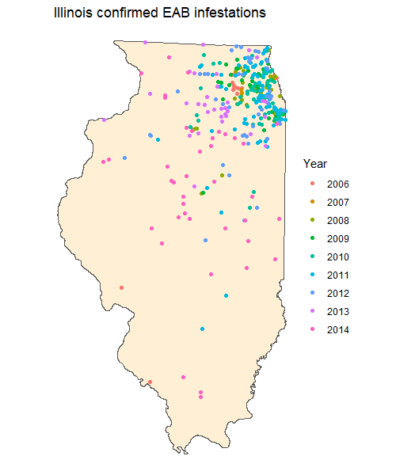
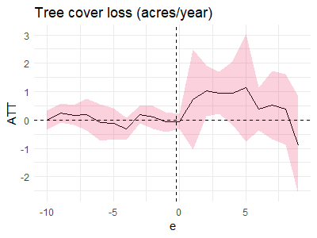
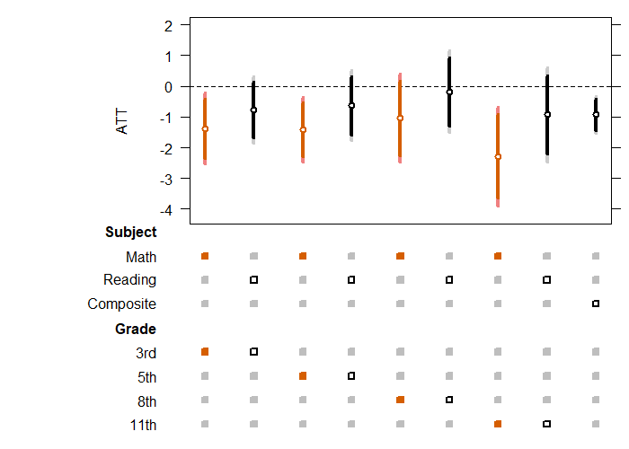

\doublespacing

```{r setup, include=FALSE}
library(knitr)
library(ggplot2)
library(kableExtra)
library(tidyverse)
library(Metrics)
library(reshape2)

knitr::opts_chunk$set(echo = FALSE, warnings = FALSE, messages = FALSE, out.width="49%", fig.align = "center")

palette <- list("white" = "#FAFAFA",
                "light_grey" = "#d9d9d9",
                "dark" = "#0c2230",
                "red" = "#ed195a",
                "blue" = "#1c86ee",
                "green" = "#7CAE7A",
                "dark_green" = "#496F5D",
                "gold" = "#DAA520")
```
<!--
TO DO LIST

TIMING
- leaf out 
- tests taken in March
- infestation and leaf out timing

WEALTH
- Woongchan: school district data
- descriptive statistics describing where infestations occur
- heterogeneity in impacts by income/race

MECHANISMS
- PRISM temperature data
-- estimate whether infestation impacted max temp (annual and month of ISAT)
- Pollution
-- Jude Beyham?
- No single mechanism can create this change
-- cite literature on temperature impacts


New Paper Structure
1. Introduction
2. Ash borer
3. Data
4. Methods
5. Results
5.1 Main results
5.2 Dynamic effects
5.3 Heterogeneous treatment effects
6. Mechanisms
6.1 Pollution
6.2 Temperature
6.3 Labor
6.4 Pesticides
7. Conclusions
-->

# Abstract {-}
This paper shows that ecosystem degradation in metropolitan areas has ramifications for education outcomes. I leverage variation from the introduction of an invasive insect that exclusively targets ash trees, the emerald ash borer, to the Chicago Metropolitan area. Exploiting the staggered and idiosynchratic spread of the borer, I show how tree canopy cover, pollution, and education outcomes were affected. Difference-in-differences methods that are robust to general treatment effect heterogeneity indicate that infestation led to a XX percentage point drop in canopy cover and a XX percent increase in PM 2.5 exposure on average. Further, schools within 2.5 kilometers of a confirmed infestation site saw decreased attendance rates and declines in standardized test performance. The impacts were felt most strongly by low-income students. This paper shows that ecological disruption can substantially impact ecosystem service provision and ultimately, education outcomes. 

# Introduction

Invasive species can have significant impacts on environmental quality and provision of ecosystem services. There is a growing recognition of the need for research on the economic impacts of ecosystem disruption [@frank2022; @ferraro2019; @fenichel2014], however, there still exists little causal evidence. Economists have only recently started to study the pathways through which invasive species affect economic outcomes [@jones2020-ere]. 

Quasi-experimental evidence that examines how changes in biological features of the
environment affect human well-being and behavior is scarce [@frank2022]. This is particularly true for the relationship between economic outcomes and invasive species induced ecosystem changes. 

In this paper, I provide the first plausibly causal evidence documenting the relationship between education impacts of invasive species induced ecosystem degradation. To do so, I leverage variation from the introduction of the emerald ash borer to the metropolitan Chicago area, which led to devastation of the region's ash tree population. The staggered and indiosynchratic spread of the ash borer throughout the region allow me to utilize recently developed difference-in-differences estimators that rely on a plausible conditional common trends assumption to recover the causal impacts of the ash borer. 

I find that ash borer infestation led to a XX percentage point decline in the canopy cover of affected areas. Further, these negative canopy cover impacts led to relatively poorer standardized test performance and attendance rates, particularly amongst low-income students. There are several mechanisms through which the ash borer may have negatively affected education outcomes including increased air and noise pollution, increased temperatures, and insecticide use. I explore these potential pathways and find that it is unlikely the impacts can be attribute to any single mechanism.  

This work makes several key contributions. First, this paper shows that invasive species, and ash borer specifically, led to measurable ecosystem degradation in metropolitan settings. While work in economics [e.g., @jones_labor_2020; @jones_infant_2018] has explored the impacts of the emerald ash borer, this is the first to measure the extent of its impact on canopy cover. Second, this paper causally identifies the effect of invasive species introduction on educational outcomes through a channel of ecosystem degradation. 

<!-- Trees provide substantial ecosystem services, particularly in metropolitan settings. These benefits include reduction of traffic pollution, psychological benefits, and moderation of hot temperatures. The association between the amount of trees and improved educational attainment and performance has been well documented [e.g., @kweon2017], however, there exists scant causal evidence outside of the laboratory setting. They also have aethetic benefits that manifest in higher property values and increased recreation opportunities [add cite]. Tree cover is accepted to have human health benefits and more broadly to improve quality of life of urban inhabitants [@turner-skoff2019].  -->

<!-- Trees and vegetation are also associated with improved education outcomes. The association between the amount of trees and improved test performance has been well documented [e.g., @kweon2017]. Children exposed to more green vegetation show enhanced cognitive development and higher scores on cognitive development tests [@dadvand2015]. Green environments, such as open spaces with big trees, are even related to reduced symptoms of ADD and ADHD [@faber2009].  -->

<!-- These improved outcomes may operate through several different channels. Urban tree cover is known to mitigate traffic-related air pollution [@nowak2006]. Trees may also reduce noise, allowing students to better focus [@gidlof-gunnarsson2007]. There are also psychological benefits associated with increased tree cover in neighborhoods and surrounding schools. @li2016 found that students who had views of trees and green environment from their classrooms, as compared to being in a room without windows or a room with a view of a brick wall, scored substantially higher on tests measuring attention, and they had a faster recovery from a stressful event. Studies consistently show a positive relationship between natural landscapes and enhanced physical activity amongst younger students [@dyment2007]. -->

<!-- One major threat to metropolitan and urban tree populations is the introduction of insect pests. The emerald ash borer (EAB) is one such pest, first detected in North America in 2002. EAB has been referred to as the most destructive forest pest ever introduced to the United States [@nowak2016], and ash trees have suffered extensively across the continent. EAB has spread extensively and had killed tens of millions of US ash trees already by 2013, leaving little hope that ash populations will recover [@flower2013].  -->


# Background

The emerald ash borer(EAB) is one of several introduced pests that has affected US tree cover, but it may represent a worst-case scenario [@herms2014]. EAB exclusively targets ash trees, and all species of North American ash are vulnerable. Infestation is essentially fatal to any infested tree, so the arrival of EAB has meant the death or removal of millions of ash trees across the country. It appears increasingly likely that EAB could functionally extirpate the North American ash [@herms2014].

The Chicago region is the third-largest metropolitan region in the United States, and lies in a region heavily affected by EAB. The impacts of EAB on the region's ash populations has been well recognized. Prior to the arrival of EAB, ash trees were the most numerous non-invasive tree species in the region [@treecensus2020], however, EAB has decimated ash populations. A Chicago region tree census revealed that the area's standing ash population nearly halved between 2010 and 2020, dropping from an estimated 13 million to under 7 million [@treecensus2020]. Of those 7 million remaining standing trees, 4 million are either dead or in decline. Further, as of 2020, more than 30\% of ash trees in the region are saplings, likely having regenerated from removed adults. Although many ash trees were replaced with alternative species and canopy cover broadly increased across the region, the overall number of large trees (> 6 inch diameter) dropped. 

There exists previous work on impacts of EAB and other forest attacking pests in the economics literature. @jones_labor_2020 explores the labor market effects of county-level EAB detections in the United States, finding that wage earnings fall in the years after EAB detection. @jones_infant_2018 use difference-in-differences methods to determine that infant health outcomes suffered after county-level EAB detections. @druckenmiller2020 instruments for tree mortality in the American West using the temperature threshold at which bark beetles experience winter die-off. They find that beetle-induced tree mortality decreased the value of timber tracts and home values and reduced hazard protection from air pollution, flood risk, and burn area. 

There also exists a significant literature on the education impacts of ecosystem disturbances.
- Literature on temperature
- PM2.5
- Wildfire smoke

# Data and descriptive statistics

## Emerald ash borer survey

While infestations expand over relatively short distances through natural dispersal, infestations may go undetected for long periods. Long-distance spread occurs when infested material such as nursery stock or firewood is moved, potentially spurring new satellite populations. EAB infestation is fatal to all ash trees, however, it is difficult to detect until a tree is extensively damaged by the EAB and begins to show symptoms. Therefore, timely EAB detection requires systematic survey efforts.

After the first EAB detections in 2006, the Illinois Department of Agriculture (IDA) initiated survey efforts to determine the extent of EAB spread. The IDA survey consisted of destructive bark peeling of selected trees. Selected trees were generally 4-8 diameters in width and in areas of easy and clear right-of-way access, with efforts to sample 1 tree per 4 square miles. Initially, the EAB damage was minimal as the detection method results were mostly negative, but positive finds became more and more prevalent. Ultimately, the state stopped survey efforts in 2015, as EAB spread had become extensive. Figure \@ref(fig:survey) displays the locations of confirmed EAB infestations by year through the survey. 


```{r survey, echo=FALSE, fig.cap="Locations of confirmed EAB infestations from IDA survey", out.width = '90%', fig.show='hold',fig.align='center'}



```

## Chicago metropolitan area tree cover

I use two main data sources to understand how ash borer affected tree cover in the Metropolitan Chicago region. I first use annual 30m resolution tree loss and tree gain maps developed in XX. These maps span XX to XX and importantly, allow me to differentiate changes in tree cover gain from tree cover loss. In order to better understand overall canopy cover trends and impacts, I also use annual 30m maps of canopy cover spanning from XX to XX. These yield the random forest probability that a given pixel is canopy cover in any year. This is preferable to binary canopy cover classification, because while small canopy cover changes may not manifest in a binary change, they likely affect the latent probability outcome. 

The biggest concern with both of these data products is low resolution. Many ash trees in metropolitan areas are street trees, the loss of which may not manifest in a 30m resolution product. I have also been able to obtain a 1m resolution map from Chicago's Morton Arboretum detailing canopy cover change between 2010 and 2018 (measured only in the two endpoint periods, not annual) but am currently unsure whether there is substantial benefit to integrating this data into the analysis. 

```{r box-infestations, echo=FALSE, fig.cap="Locations of confirmed EAB infestations within study area", out.width = '49%', fig.show='hold',fig.align='center'}

knitr::include_graphics(
  c("figs/IL_infestations_boxL.png", "figs/IL_infestations_boxR.png")
                        )

```

## Education and test score data

Education data come from the Illinois State Board of Education (ISBE), which release annual reports on the performance of each school in the state on a number of metrics. I take advantage of four primary outcomes: 1) attendance rates; 2) dropout rates; 3) performance on the Illinois Standards Achievement Test (ISAT); and 4) performance on all tests. 

The ISAT was instituted for the purpose of identifying failing schools. Students were tested in reading and math from grades 3–8. The Illinois State Board of Education (ISBE) reported school-level performance on the test between 2003 and 2014, when the ISAT was retired. These data include the percentage of students who meet or exceed standards set by the state. I geocode locations of each public school in the state of Illinois using addresses provided by ISBE. This allows me to know the location of each school relative to confirmed EAB infestations. 

## Other covariates

ACS data

## Descriptive statistics

- where do infestations occur

# EAB infestation confirmation as a natural experiment

## Difference-in-differences methods

In this section, I use difference-in-differences methods developed in @callaway2020. The estimator is robust to general treatment effect heterogeneity that may plague commonly utilized two-way fixed effects regressions. These results rely on a common trends assumption, which amounts to assuming that outcomes in the treatment group would have followed the same evolution as those in the control and not yet treated groups, had treatment never occured. 

Given the idiosynchratic nature of EAB spread through insect flight or accidental transportation in addition to the systematic nature of the IDA survey, confirmed detections can be thought of as quasi-random. These quasi-random infestation confirmations provide me with an exogenous shock to tree communities and canopy cover.

# Environmental impacts of the emerald ash borer

## Canopy cover

In this section, I aim to establish that confirmed EAB infestations lead to reduced canopy cover. There are two main channels through which EAB detection may result in tree loss. The first is through the EAB directly, as an ash tree will die between one and four years following infestation, depending on the size and health of the individual. The second is through intentional removal of infested trees. Most communities declare any confirmed infested tree a public nuisance and require that the tree be removed [e.g., @macomb2007]. As such, a confirmed infestation is likely to lead to quicker removal of infested or dead trees in the vicinity, in addition to death of trees due to EAB infestation. 

Because removed trees are likely replaced with new trees, some may question why we should observe canopy cover loss on an annual scale. Most replacement trees are unlikely to generate the canopy cover of large healthy trees. A newly planted tree may have trunk diameter as small as two inches and provide little to no canopy cover, while a large healthy ash may grow 60 feet tall and 25 to 40 feet wide (Morton Arboretum). 

EAB detection may also lead to lower levels of tree cover gain. Removal of damaged or dead trees is costly to individuals and communities. Estimates suggest a cost near \$1,000 to remove and replant a single tree. More broadly, EAB had a massive impact on forestry budgets across the United States [@hauer2017]. While budgets in states with confirmed EAB infestation saw sizable increases in tree removal budgets relative to non-EAB confirmed states, budgets for tree planting did not change. Because most removed trees are likely replaced, it is plausible that trees that would've been planted in the absence of EAB were never established. In other words, funding allocated for establishing new tree cover instead went toward replacement of EAB infested trees. 

I define treatment status using confirmed infestations from the IDA bark peeling survey described previously. An IDA confirmed infestation indicates that not only are trees in the vicinity infested and ultimately likely to die, but that community officials are aware of the need for tree removal and replacement. Because infestations are often hard to detect, a confirmed infestation can be thought of as an exogenous event that spurs new removal and replacement activity.

In this section, the unit of analysis is the 3km grid cell. A grid cell is valuable for several reasons. First, a confirmed infestation likely indicates that there are EAB present in not only the surveyed tree but in nearby trees as well. Table @\ref(tab:treegrid) indicates that a confirmed EAB infestation leads to an average reduction of `r round(loss$ATT, digits = 2)` acres of canopy cover within a 3km grid cell.

```{r treegrid}

df <- readRDS("results/eab_tree_results_grid5km.rds")%>%
  filter(outcome %in% c("gain", "loss"))

gain <- df[1,]
loss <- df[2,]

n = 609

```

\begin{table}[H]\centering
\caption{estimated ATT of EAB infestation on tree cover (acres per year within 5km grid cell)}
\smallskip
\begin{tabular}{c c c}

\toprule
  Dependent variable: & Tree cover loss & Tree cover gain\\ 
\midrule
 $\widehat{ATT}$  &       `r loss$ATT`*** &  `r gain$ATT`**   \\
             &      (`r loss$se`) &    (`r gain$se`)    \\ 
\midrule
Grid cell area      &     $25km^2$    &  $25km^2$  \\ 
 Number of grid cells      &     `r n`    & `r n` \\          
\bottomrule
\addlinespace[1ex]
\multicolumn{3}{l}{\textsuperscript{***}$p<0.01$, 
  \textsuperscript{**}$p<0.05$, 
  \textsuperscript{*}$p<0.1$}
\end{tabular}
\end{table}

Figure \@ref(fig:tree-grid-es) displays event study estimates in order to understand the dynamics of canopy cover change following infestation. This figure also allows us to gauge the plausibility of the common trends assumption on which this identification strategy relies. The assumption seems plausible given the similar pre-trends in outcomes as well as the quasi-random nature of EAB infestation confirmation timing. 

```{r tree-grid-es, echo=FALSE, fig.cap="Left: Confirmed EAB infestation leads to a temporary increase in tree cover loss; Right: Confirmed EAB infestation leads to a decline in tree cover gain", out.width = '49%', fig.show='hold',fig.align='center'}



```


### Heterogeneity

- Effect is actually through ash trees
- Which communities suffer the highest losses in tree cover

## Pollution

## Temperature

# Education impacts of the emerald ash borer

In this section, I now focus on individual schools as the unit of analysis. An individual school is considered treated when a confirmed infestation is detected within 3km of the school. Figure \@ref(fig:school-exposure) shows the locations of the public schools in the Chicago Metropolitan area.  

## Attendance rates

## Standardized test scores

The outcome variable reflects the percent of students who scored at a level meeting or exceeding the minimum acceptable score determined by the state. Future iterations of this work will include other education outcomes such as attendance rates and dropouts. 

```{r schart-test, echo=FALSE, fig.cap="Impacts of confirmed EAB infestation on ISAT scores. Math test scores are highlighted in orange. Both 95 (faded) and 90 percent confidence intervals are displayed around point estimates.", out.width = '100%', fig.show='hold',fig.align='center'}



```

Figure \@ref(fig:schart-test) shows the estimated impacts of confirmed EAB infestation on ISAT test performance across a variety of subjects and grade levels. We see that confirmed EAB infestation in the vicinity of schools has a negative impact on that school's ISAT scores. 

Figure \@ref(fig:test-es) shows event study estimates for composite ISAT performance and all standardized test performance. 

```{r test-es, echo=FALSE, fig.cap="Event study results for the impact of EAB infestation on test performance. Left: ISAT composite; Right: all standardized tests", out.width = '49%', fig.show='hold',fig.align='center'}

knitr::include_graphics(
  c("figs/eab_test_ISAT.png", "figs/eab_test_math11.png")
                        )

```

# Discussion


# References
<div id="refs"></div>

# Appendix